<div align="center">

# 🖋️ InkFlow

**会呼吸的 Markdown 编辑器 —— 对标 Typora 的所见即所得写作体验**

*光标落在哪里，哪里就显示源码；移开后立刻变回排版。不分栏、不切换、不打断心流。*

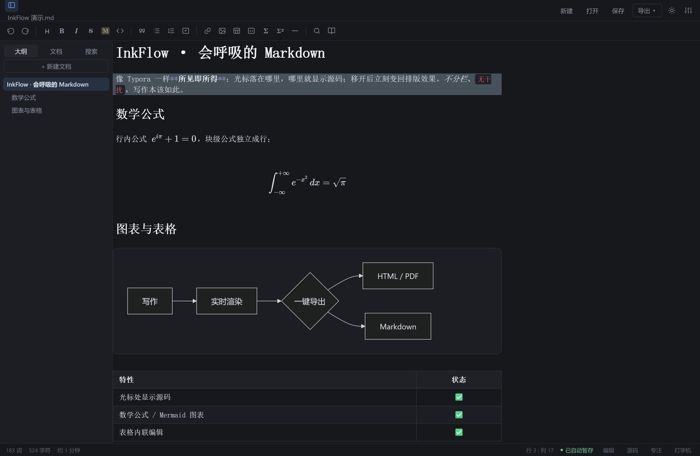


**[特性一览](#-特性一览) · [九套主题](#-九套内置主题) · [快速开始](#-快速开始) · [快捷键](#-快捷键) · [架构](#-架构) · [开发与测试](#-开发与测试)**

</div>

---

## 🤔 为什么是 InkFlow

主流 Markdown 编辑器分两类：要么像 VS Code 那样**左写右看**，视线在两栏之间来回跳；要么像纯文本编辑器一样只有源码，排版效果全靠脑补。Typora 证明了第三条路——**输入即渲染**——才是写作工具的终点，但它收费且封闭。

InkFlow 用 100% 原生 JavaScript + CodeMirror 6 实现了这条路：

- **单栏 WYSIWYG**：基于 Lezer 语法树构建 Decoration，光标所在节点显示 Markdown 源码，其余位置全部直接渲染——标题实时放大、`**` 和 `~~` 隐藏、列表符变圆点、引用块整块着色；
- **纯本地**：无账号、无云端、无遥测，文件就在你自己的磁盘上；
- **轻**：无框架、无运行时，esbuild 打包后单个入口仅 200KB 级。

## ✨ 特性一览

**✍️ 所见即所得**

- 光标处显示源码、移开即渲染，支持标题 / 加粗 / 斜体 / 删除线 / 高亮 / 行内代码等全部语法
- 数学公式（KaTeX 行内 `$…$` 与块级 `$$…$$`）、Mermaid 图表、脚注、`[toc]` 目录、任务勾选框
- 表格渲染为真表格，支持单元格内联编辑、右键增删行列、对齐方式调整
- 图片支持 `![alt|400]` 宽度语法；超长文档（>60 万字符）自动降级为源码高亮保流畅

**🗂️ 文件管理**

- 打开文件夹生成侧栏文件树，懒加载子目录；浏览器走 File System Access API，桌面版走原生 IPC
- 文档库 · 历史快照（每日一份、保留 7 天、跨会话保留）· 最近文件
- `Ctrl+P` 模糊快速打开；全文件夹全文搜索（桌面版由主进程 `fs:grep` 加速）

**💾 保存与同步**

- 700ms 防抖自动保存 + 本地暂存双保险；检测文件外部修改（mtime 冲突即停，绝不静默覆盖）

**🎨 外观**

- 9 套内置主题，一键循环切换；支持**导入 Obsidian 主题 CSS**——自动解析变量并映射为 InkFlow 配色
- 阅读模式（点击不出源码）· 专注模式 · 打字机模式 · 源码模式
- 字号 / 行高 / 页宽可调，中英文之间自动补盘古之白，字数与阅读时长统计

**📤 导入 / 导出 / 粘贴**

- 导出自包含 HTML（KaTeX、代码高亮、Mermaid 内联 SVG、文档样式全部内联，单文件即可分发）
- 一键导出 PDF（按主题深浅自动配色）、Markdown、剪贴板富文本
- 粘贴富文本自动转 Markdown（Turndown + GFM）；粘贴 / 拖入截图自动落盘到 `assets/` 目录

## 🎨 九套内置主题

| 墨夜 Dark | 素白 Light |
|:---:|:---:|
| 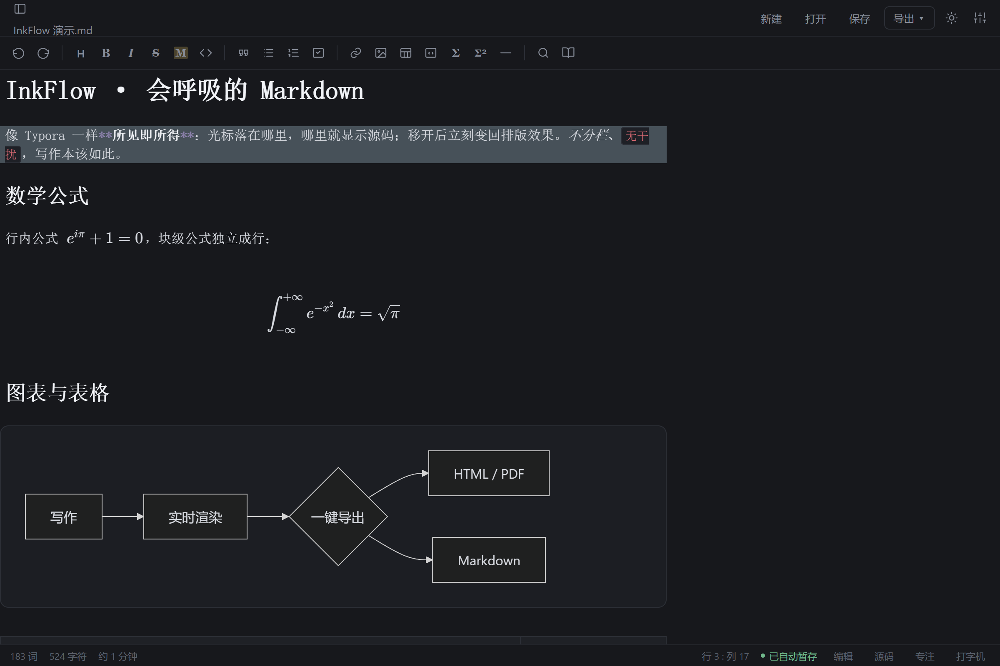 | 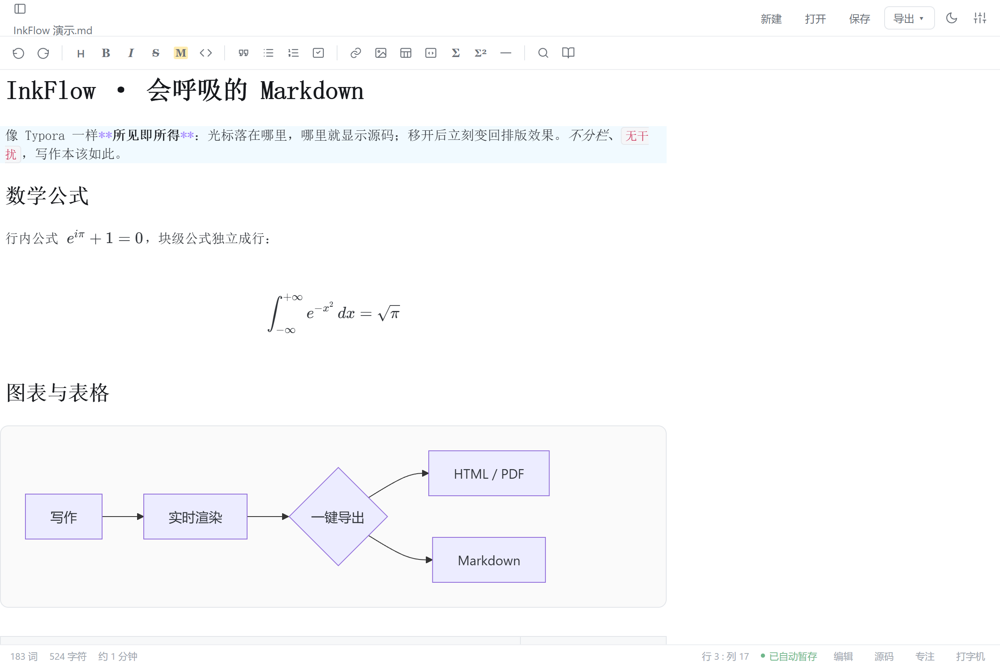 |
| **德古拉 Dracula** | **北极光 Nord** |
| 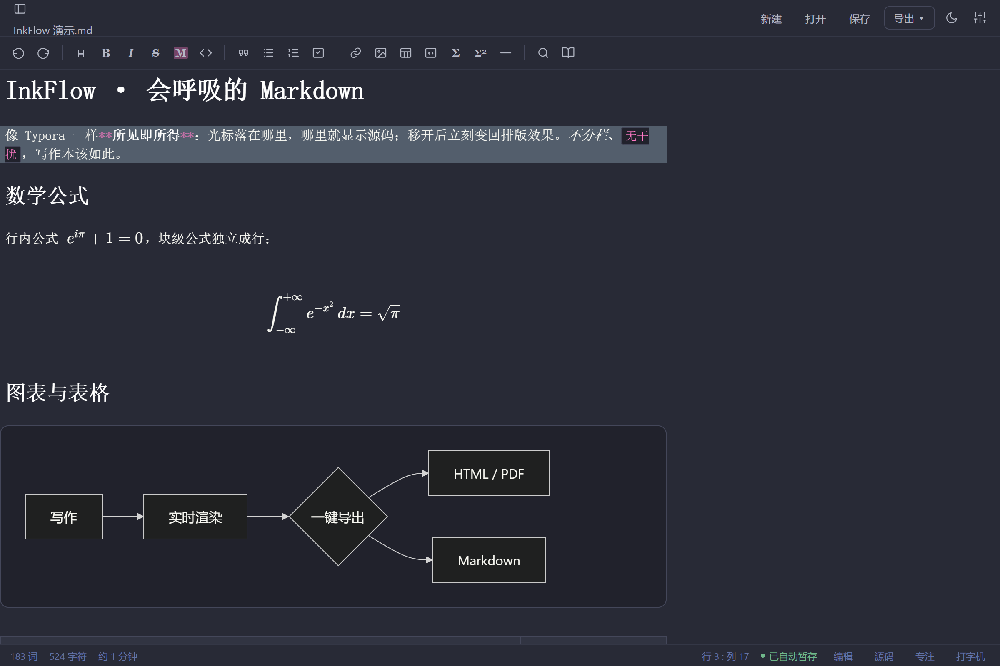 | 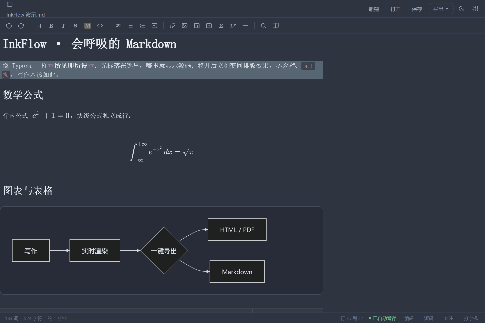 |
| **东京之夜 Tokyo Night** | **墨池青黛 Ink Wash** |
| 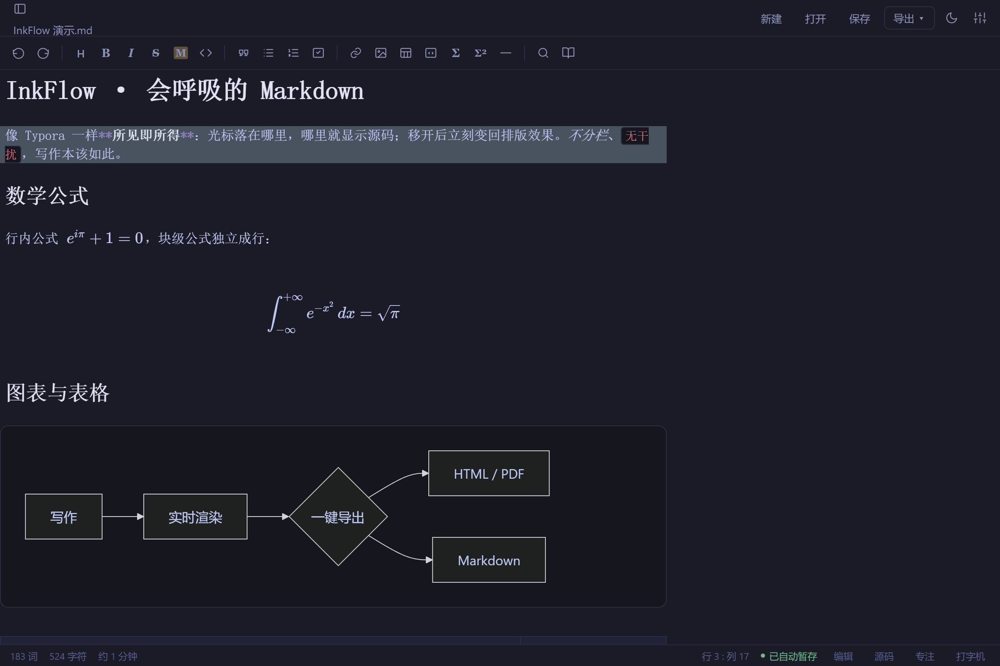 | 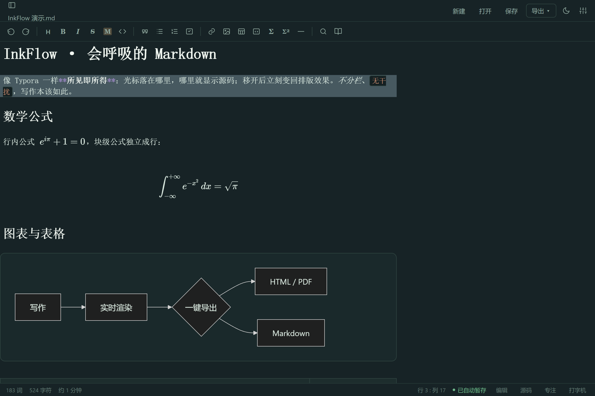 |
| **碳素紫晶 Carbon Lilac** | **藏经纸 Paper Saffron** |
| 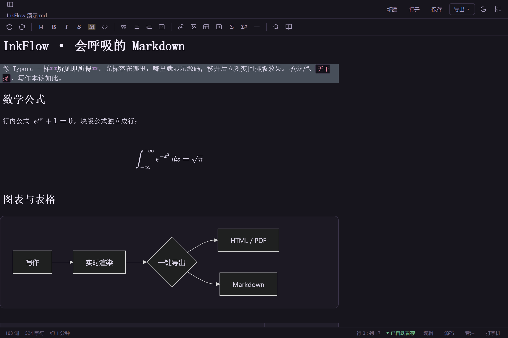 | 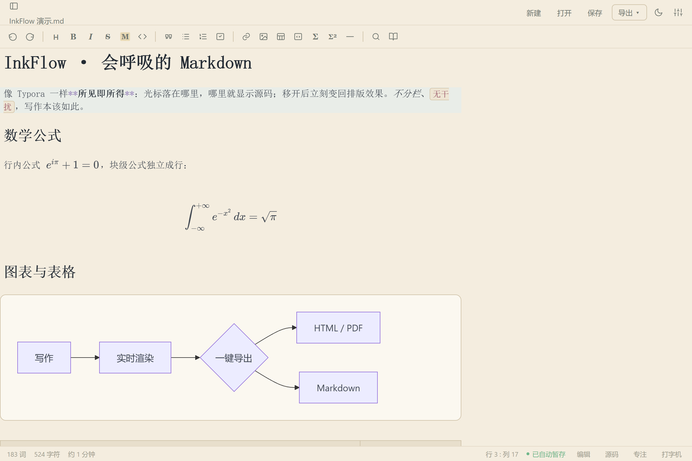 |
| **日光 Solarized Light** | **Auto · 跟随系统深浅** |
| 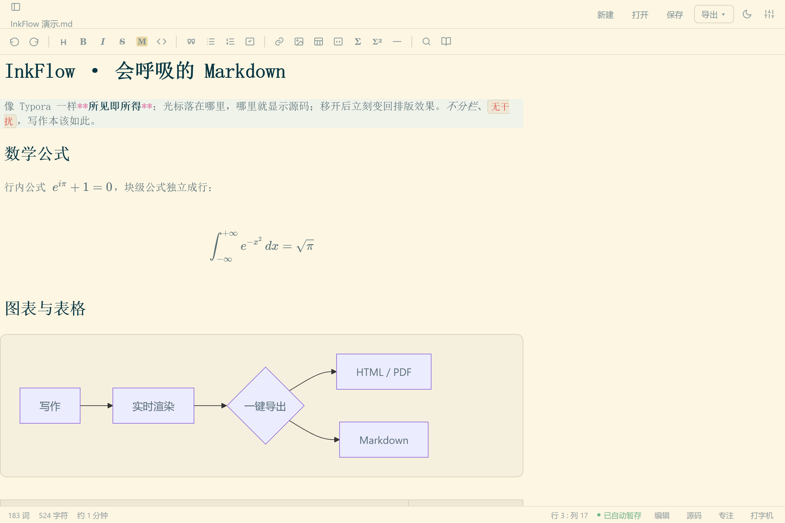 | 设置面板选择「跟随系统」，昼夜自动切换 |

> 本 README 所有截图均由 `test/make-readme-shots.mjs` 驱动真实应用生成，可随时复现。

## 🚀 快速开始

### 浏览器版

```bash
git clone https://github.com/whymesocooll/markdown.git inkflow
cd inkflow
npm install
npm run build          # 打包到 dist/
npx serve dist         # 或任意静态服务器，打开 http://localhost:3000
```

### 桌面版（Windows）

```bash
npm run pack           # electron-packager 打包 win32-x64
# 产物：release/InkFlow-win32-x64/InkFlow.exe，双击即用
```

桌面版额外能力：任意路径读写、文件夹树 IPC 加速、全文搜索原生 `fs:grep`、截图粘贴直接落盘到文档同目录。

## ⌨️ 快捷键

<details open>
<summary><b>格式化</b>（工具栏按钮与快捷键共用同一实现）</summary>

| 快捷键 | 功能 | 快捷键 | 功能 |
|---|---|---|---|
| `Ctrl+B` | 加粗 | `Ctrl+I` | 斜体 |
| `Ctrl+Shift+X` | 删除线 | `Ctrl+Shift+H` | 高亮 |
| ``Ctrl+` `` | 行内代码 | `Ctrl+Shift+K` | 代码块 |
| `Ctrl+K` | 链接 | `Ctrl+Shift+I` | 图片 |
| `Ctrl+Shift+Q` | 引用 | `Ctrl+Shift+-` | 分隔线 |
| `Ctrl+Shift+L` | 无序列表 | `Ctrl+Shift+O` | 有序列表 |
| `Ctrl+Shift+T` | 任务列表 | `Ctrl+Shift+M` | 行内公式 |
| `Ctrl+Alt+M` | 公式块 | `Ctrl+Alt+T` | 表格 |
| `Ctrl+Alt+F` | 脚注 | `Ctrl+0…6` | 正文 / 一至六级标题 |

</details>

<details>
<summary><b>编辑器与界面</b></summary>

| 快捷键 | 功能 | 快捷键 | 功能 |
|---|---|---|---|
| `Ctrl+S` | 保存 | `Ctrl+Shift+S` | 另存为 |
| `Ctrl+O` | 打开文件 | `Ctrl+Alt+N` | 新建文档 |
| `Ctrl+P` | 快速打开（模糊匹配） | `Ctrl+Shift+P` | 导出 PDF |
| `Ctrl+\` | 侧栏开关 | `Ctrl+/` | 源码模式 |
| `Ctrl+Alt+R` | 阅读模式 | | |

</details>

## 🏗️ 架构

纯浏览器应用：原生 JS + CodeMirror 6，无框架、无运行时依赖，esbuild 以 ESM + splitting 打包，动态 import 按需加载语言包 / Mermaid / Turndown。同一套代码经 Electron 封装为桌面应用（文件系统走 IPC，浏览器走 File System Access API）。

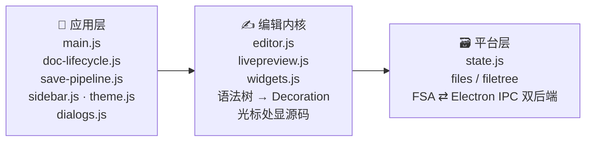

**模块速览**

- **组装根** `main.js` —— 工具栏与菜单、设置面板、粘贴管线（图片落盘 + 富文本转 Markdown）、快速打开、全文搜索
- **文档** `doc-lifecycle.js`（新建 / 打开 / 导出 / 历史）· `save-pipeline.js`（自动保存 / 本地暂存 / mtime 冲突检测）
- **界面** `sidebar.js`（大纲 / 文件树 / 文档库）· `theme.js`（九套主题 + Obsidian 主题导入）· `dialogs.js`（toast / 确认 / 输入）
- **内核** `livepreview.js`（WYSIWYG 装饰引擎）· `widgets.js`（公式 / 表格 / Mermaid / TOC）· `editor.js`（CodeMirror 6 装配）· `commands.js`（格式化命令）
- **平台** `files.js` / `filetree.js`（文件系统双后端）· `state.js`（全局状态 / 设置校验）· `exporter.js`（自包含 HTML / PDF 导出）

**WYSIWYG 是怎么做到的？** [`livepreview.js`](src/livepreview.js) 在每次文档变化后遍历 Lezer 语法树，结合光标位置生成一套 Decoration：光标所在节点套上"显示源码"的替换装饰，其余节点套上"隐藏标记 / 替换为渲染结果"的装饰。数学块、脚注、`[toc]` 等非语法树结构用正则按行扫描补齐，全部装饰经过冲突过滤后一次性提交给 CodeMirror。所有块级替换严格遵循「含行尾换行符 + `inclusiveEnd: false`」约定，保证点击坐标与文档模型永不错位。

## 🧪 开发与测试

```bash
npm run dev            # watch 模式
npm test               # 构建 + 全量回归（puppeteer 驱动本机 Edge）
npm run smoke:desktop  # Electron 冒烟：preload 桥 + 编辑器挂载 + IPC 往返
node test/make-readme-shots.mjs   # 重新生成本 README 的全部截图
```

测试全部基于 `window.InkFlow` 调试入口驱动真实编辑器，无测试框架、退出码即结果：

| 脚本 | 覆盖范围 |
|---|---|
| `test/smoke.mjs` | 渲染、命令、导出、主题 |
| `test/click.mjs` | 点击定位回归（坐标模型一致性） |
| `test/mermaid.mjs` | 图表渲染 / 光标回源码 / 导出内联 SVG |
| `test/table.mjs` | 表格内联编辑与右键菜单 |
| `test/tree.mjs` | 文件树渲染 / 懒加载 / 打开文件 |
| `test/readmode.mjs` | 阅读模式只读与装饰行为 |
| `test/autosave.mjs` | 自动保存与 mtime 冲突 |
| `test/obsidian.mjs` | Obsidian 主题解析（纯函数直测） |
| `test/vault.mjs` | 文档库 / 历史快照 |

## 🙏 致谢

站在这些项目的肩膀上：[CodeMirror 6](https://codemirror.net/) · [KaTeX](https://katex.org/) · [Mermaid](https://mermaid.js.org/) · [marked](https://marked.js.org/) · [highlight.js](https://highlightjs.org/) · [Turndown](https://github.com/mixmark-io/turndown) · [Electron](https://www.electronjs.org/) · [esbuild](https://esbuild.github.io/)

---

<div align="center">

**InkFlow** · 好的工具让人忘记工具的存在

</div>
