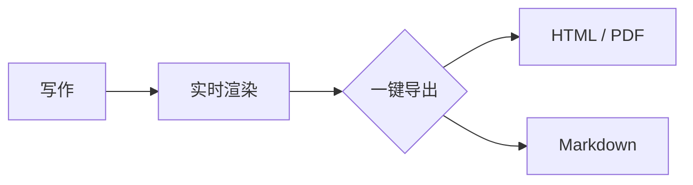

# InkFlow · 会呼吸的 Markdown

像 Typora 一样**所见即所得**：光标落在哪里，哪里就显示源码；移开后立刻变回排版效果。*不分栏*、`无干扰`，写作本该如此。

## 数学公式

行内公式 $e^{i\pi}+1=0$，块级公式独立成行：

$$
\int_{-\infty}^{+\infty} e^{-x^2}\,dx = \sqrt{\pi}
$$

## 图表与表格

| 特性 | 状态 |
| --- | :---: |
| 光标处显示源码 | ✅ |
| 数学公式 / Mermaid 图表 | ✅ |
| 表格内联编辑 | ✅ |

- [x] 中英文之间自动加空格（盘古之白）
- [x] 历史快照 · 全文搜索 · Ctrl+P 快速打开
- [ ] 下一站：由你决定

> 好的工具让人忘记工具的存在。`==高亮==` 与脚注[^1] 也不在话下。

[^1]: 像这样，安静地待在文末。
